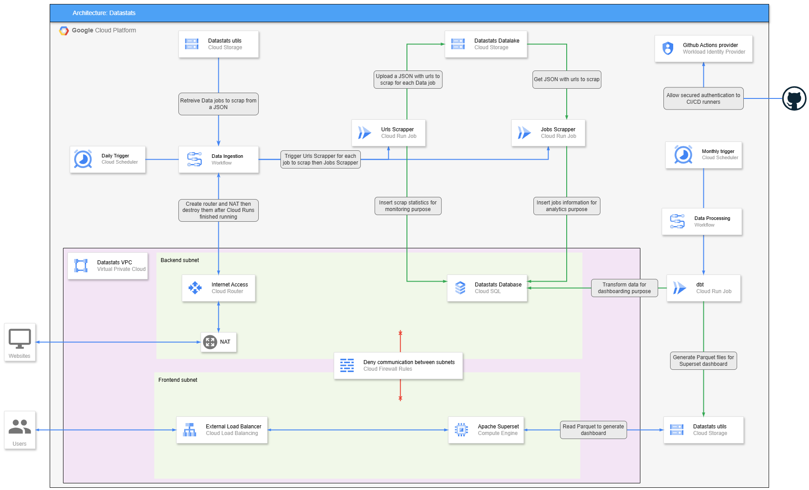

# 🚀 Datastats GCP IaC

This repository is a part of <strong>Datastats</strong> x <strong>GCP</strong> project. 

## ✨ Datastats x GCP purpose

The purpose of this project is to retrieve daily job offers in the data professions to monitor market trends and the technologies in demand. 

## 🤔 What is this IaC repository ?

This repository contains the Infrastructure as Code for the entire project, utilizing Terraform.

It enables the creation of all project resources, ensuring that no resources are created manually.

To minimize costs, the development environment is only used during coding, which is why CI/CD is only activated on the **main** branch.

**No sensitive variables are stored in this repository.**

## 👷🏻‍♀️ Architecture

This is the final architecture of the project. It's still :construction_worker: under construction :construction_worker:. 
Check "**What's next ?**" section to know what will be added soon to finish the project. 

## 💡 What's next ? 

What will be added to this repository?
- DBT Cloud Run + Scheduler
- Superset on Compute Engine
- External Load Balancer with custom domain